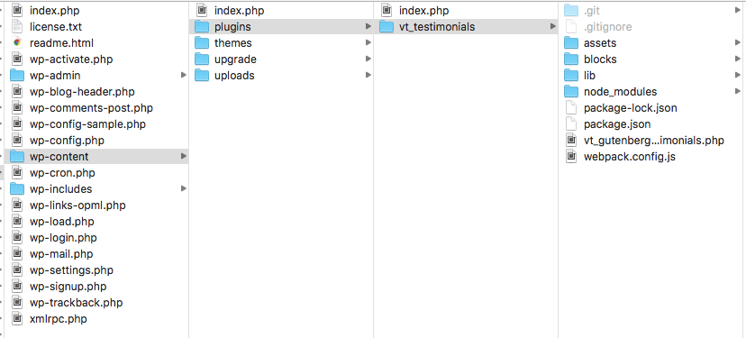
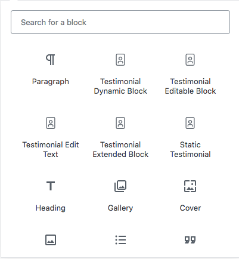
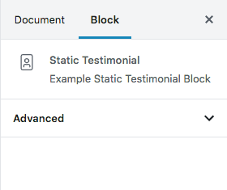
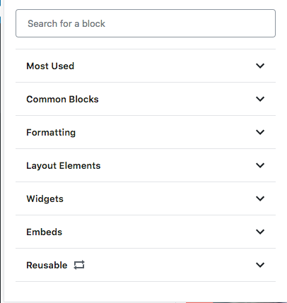
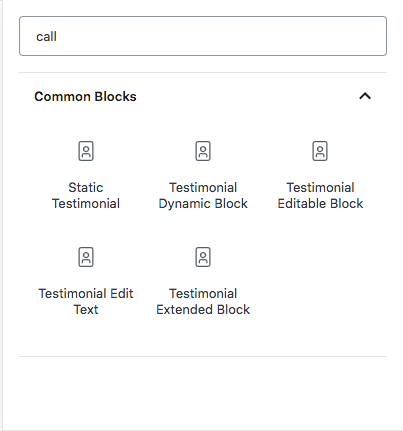
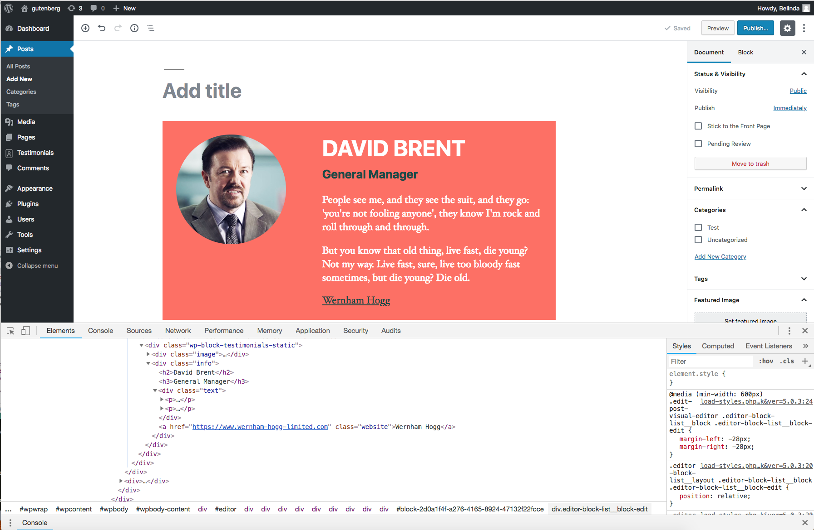
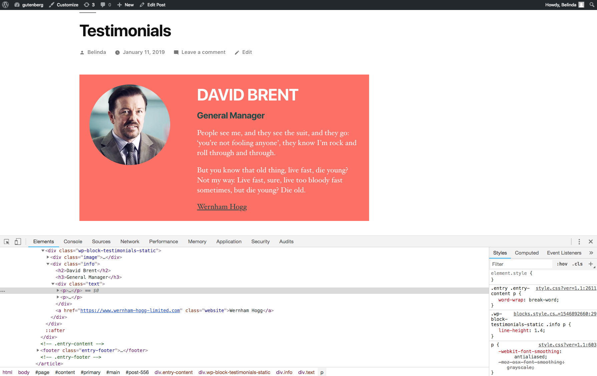

autoscale: true

# [fit] Creating a Testimonials Block.

^ My name is Belinda and I've been studying JS for about a year and a half, having taken Zac Gordons JS master course. I have been studying React and Gutenberg for a couple of months now, so although I'm by no means an expert, I wanted to share with you what I have learnt so far.

---
## This group of talks will teach you:

- Setting up the development environment
- Setting up a block
- Creating a static Testimonials block
- Making the Testimonials block have editable content
- Extending the functionality of the block
- Creating a Testimonials Custom Post Type with Gutenberg templates
- Creating a Dynamic Block
- Other useful features

All the code I'm going to use is here: so you can follow along if you wish.
`https://github.com/verytwisty/vt_gutenberg_testimonials`

And all the presention files are located here
`https://github.com/verytwisty/GutenbergTalk`

^ 
- I wanted to start from the very basics of creating a block, so this talk will probably be split over 2-3 talks.
- I created some example blocks so you can download them and play about with them on my github repro
- These slides are also on a github repro if you want to refer back to them later
- Show the example editable block


---

# Getting started


---

## Development Environment

**Node and NPM**
NPM is a package manager that lets you install the packages and dependancies you need to have a working development environment.

**Webpack**
Webpack is a bundler / task runner that was originally designed for packaging up Javascript files, but has been extended with modules run sass and other files. It is similar to gulp and grunt in that you can use it to take your raw files and it will run tasks including error linting and minification and export production ready code.


---

## Getting set up

**NPM**
`https://docs.npmjs.com/downloading-and-installing-node-js-and-npm`

**Webpack**
`https://webpack.js.org/guides/installation/`

---

## Getting setup with npm and webpack



**package.json**
`https://github.com/verytwisty/vt_gutenberg_testimonials/blob/master/package.json`

**webpack.config.js**
`https://github.com/verytwisty/vt_gutenberg_testimonials/blob/master/webpack.config.js`

In the terminal 

```
cd /wp-content/plugins/your-gutenberg-plugin/

npm i -D

```


^
- Make a folder in the plugins directory 
- in this folder you will need a package.json file to download all the npm packages you need
- If you download the packages.json file from my repro it will give you the packages you need for this project
- We also need to add a webpack configuration file, so it knows where to import and save the JavaScript files
- If you don't want to learn about webpack yet, you can use the one in my github project for now.
-  To install all the packages for this project go to the folder in the terminal and type in npm i -D, which installs everything in your plugins folder

---
## Sublime text users

Sublime text has problems with syntax highlighting JSX, Visual Studio and Atom have built in syntax highlighting.

To get round this you can install a sublime text package called Babel which will display it for you correctly

`https://packagecontrol.io/packages/Babel`

---
## Creating a plugin.


```php
/**
 * Plugin Name: Gutenberg Testimonials
 * Plugin URI:  https://github.com/verytwisty/vt_gutenberg_testimonials
 * Description: A Testimonials Plugin inspired by <a href="https://gutenberg.courses/development">Zac Gordon's Gutenberg Development Course</a> for the MWUG talk.
 * Version:     1.0
 * Author:      Belinda Mustoe
 * Author URI:  https://verytwisty.com
 * Text Domain: vt_testimonials
 * Domain Path: /languages
 * License:     GPL2+
 * License URI: http://www.gnu.org/licenses/gpl-2.0.html
 */

// Enqueue JS and CSS
include __DIR__ . '/lib/enqueue-scripts.php';
 ```
[.footer: `https://github.com/verytwisty/vt_gutenberg_testimonials/blob/master/vt_gutenberg_testimonials.php`]

^ 
Create a plugin the same way you would a normal plugin for WordPress.

---

## Backend JS and CSS files

[.code-highlight: 1-7]

```php
add_action( 'enqueue_block_editor_assets', 'enqueue_block_editor_assets' );

function enqueue_block_editor_assets() {

	wp_enqueue_script( 'testimonial-block-js', _get_plugin_url() . '/assets/js/editor.blocks.js', array( 'wp-editor', 'wp-blocks', 'wp-i18n', 'wp-element'), '1.0');
	wp_enqueue_style( 'testimonial-block-css', _get_plugin_url() . '/assets/css/blocks.editor.css', [ ], '1.0' );
}

add_action( 'enqueue_block_assets', 'enqueue_assets' );

function enqueue_assets() {

	wp_enqueue_style( 'testimonial-block', _get_plugin_url() . '/assets/css/blocks.style.css', [ ], '1.0' );
}

add_action( 'enqueue_block_assets', 'enqueue_frontend_assets' );

function enqueue_frontend_assets() {

	if ( is_admin() ) {
		return;
	}
	wp_enqueue_script( 'testimonial-js-frontend', _get_plugin_url() . '/assets/js/frontend.blocks.js', [], '1.0' );
}

```

[.footer: `https://github.com/verytwisty/vt_gutenberg_testimonials/blob/master/lib/enqueue-scripts.php`]

^ 3 functions in this file:
- `enqueue_block_editor_assets` Hook
- Enque JS and CSS files that will be used in the backend only
- editor.blocks.js
	- This is our compiled gutenberg blocks code!
	- Make sure you load the file after all the other Gutenberg script dependancies
- blocks.editor.css
	- This is CSS that loads in styles that *should not* be loaded on the front end
	- This is good for styles for error messages, information etc

---

## Front & Back End CSS

[.code-highlight: 9-14]

```php
add_action( 'enqueue_block_editor_assets', 'enqueue_block_editor_assets' );

function enqueue_block_editor_assets() {

	wp_enqueue_script( 'testimonial-block-js', _get_plugin_url() . '/assets/js/editor.blocks.js', array( 'wp-editor', 'wp-blocks', 'wp-i18n', 'wp-element'), '1.0');
	wp_enqueue_style( 'testimonial-block-css', _get_plugin_url() . '/assets/css/blocks.editor.css', [ ], '1.0' );
}

add_action( 'enqueue_block_assets', 'enqueue_assets' );

function enqueue_assets() {

	wp_enqueue_style( 'testimonial-block', _get_plugin_url() . '/assets/css/blocks.style.css', [ ], '1.0' );
}

add_action( 'enqueue_block_assets', 'enqueue_frontend_assets' );

function enqueue_frontend_assets() {

	if ( is_admin() ) {
		return;
	}
	wp_enqueue_script( 'testimonial-js-frontend', _get_plugin_url() . '/assets/js/frontend.blocks.js', [], '1.0' );
}

```

[.footer: `https://github.com/verytwisty/vt_gutenberg_testimonials/blob/master/lib/enqueue-scripts.php`]

^ `enqueue_block_assets` hook
- This adds the styles for the block to both the front end and the backend
	- blocks should look as similar as possible on the front end as on the backend for a good editing experience


---

## Front end JS

[.code-highlight: 16-24]

```php
add_action( 'enqueue_block_editor_assets', 'enqueue_block_editor_assets' );

function enqueue_block_editor_assets() {

	wp_enqueue_script( 'testimonial-block-js', _get_plugin_url() . '/assets/js/editor.blocks.js', array( 'wp-editor', 'wp-blocks', 'wp-i18n', 'wp-element'), '1.0');
	wp_enqueue_style( 'testimonial-block-css', _get_plugin_url() . '/assets/css/blocks.editor.css', [ ], '1.0' );
}

add_action( 'enqueue_block_assets', 'enqueue_assets' );

function enqueue_assets() {

	wp_enqueue_style( 'testimonial-block', _get_plugin_url() . '/assets/css/blocks.style.css', [ ], '1.0' );
}

add_action( 'enqueue_block_assets', 'enqueue_frontend_assets' );

function enqueue_frontend_assets() {

	if ( is_admin() ) {
		return;
	}
	wp_enqueue_script( 'testimonial-js-frontend', _get_plugin_url() . '/assets/js/frontend.blocks.js', [], '1.0' );
}

```

[.footer: `https://github.com/verytwisty/vt_gutenberg_testimonials/blob/master/lib/enqueue-scripts.php`]


^ `enqueue_block_editor_assets`
- This adds JS to the front end only
	- Good for making things work like carousels, tabs etc
- use the 'enqueue_block_assets' hook and bail if this is being run on the back end.
- Any Questions so far?

--- 

# Basic Block Architecture

[.footer: `https://github.com/verytwisty/vt_gutenberg_testimonials/blob/master/blocks/0-starter-block/index.js`]

^ Now that we have set up the basic plugin file we can have a look a simple block example file. This can be called anything as long as you remember to import it in the main index.js file

---

```js
import './editor.scss';
import './style.scss';

const { __ } = wp.i18n;
const { registerBlockType } = wp.blocks;

export default registerBlockType(
	'namespace/blockname',
	{
		title: __('Block Name', '_vt'),
		description: __('Description of the block', '_vt'),
		category: 'common',
		icon: dashicon || svgIcon,
		keywords: [
			__( 'Key Word 1', '_vt' ),
			__( 'Key Word 2', '_vt' ),
			__( 'Key Word 3', '_vt' ),
		],
		edit: props => {
			const { className } = props;
			return (
				<div className={ className }>Block Back End </div>
			);
		},
		save: props => {
			const { className } = props;
			return (
				<div className={ className }>Block Front End</div>
			);
		},
	},
);
```
[.footer: `https://github.com/verytwisty/vt_gutenberg_testimonials/blob/master/blocks/0-starter-block/index.js`]

^This is the most basic block possible, there is not a lot of code there, but we will go through it as this will be standard across all blocks.

---

[.code-highlight: 1-2]

```js
import './editor.scss';
import './style.scss';

const { __ } = wp.i18n;
const { registerBlockType } = wp.blocks;

export default registerBlockType(
	'namespace/blockname',
	{
		title: __('Block Name', '_vt'),
		description: __('Description of the block', '_vt'),
		category: 'common',
		icon: dashicon || svgIcon,
		keywords: [
			__( 'Key Word 1', '_vt' ),
			__( 'Key Word 2', '_vt' ),
			__( 'Key Word 3', '_vt' ),
		],
		edit: props => {
			const { className } = props;
			return (
				<div className={ className }>Block Back End </div>
			);
		},
		save: props => {
			const { className } = props;
			return (
				<div className={ className }>Block Front End</div>
			);
		},
	},
);
```
[.footer: **Import Block dependancies**  `https://github.com/verytwisty/vt_gutenberg_testimonials/blob/master/blocks/0-starter-block/index.js`]

^Import Block dependancies
Import code from scss files and other js files that is used by the block.

---

[.code-highlight: 4-5]

```js
import './editor.scss';
import './style.scss';

const { __ } = wp.i18n;
const { registerBlockType } = wp.blocks;

export default registerBlockType(
	'namespace/blockname',
	{
		title: __('Block Name', '_vt'),
		description: __('Description of the block', '_vt'),
		category: 'common',
		icon: dashicon || svgIcon,
		keywords: [
			__( 'Key Word 1', '_vt' ),
			__( 'Key Word 2', '_vt' ),
			__( 'Key Word 3', '_vt' ),
		],
		edit: props => {
			const { className } = props;
			return (
				<div className={ className }>Block Back End </div>
			);
		},
		save: props => {
			const { className } = props;
			return (
				<div className={ className }>Block Front End</div>
			);
		},
	},
);
```
[.footer: **Import Block dependancies**  `https://github.com/verytwisty/vt_gutenberg_testimonials/blob/master/blocks/0-starter-block/index.js`]

^
- Import Gutenberg dependancies that are required in the file.
- These are the two basic depenancies that you will need for every block, there are many others that we will look at later.
- registerBlockType is pulled in from wp.blocks. This allows you to register your block
- __ is pulled in from the wp.i18n (internationalisation) library. This allows all your text strings to be translated.

---

## Example of translatable String


```

__('This string is ready for translations in the .pot file', '_vt');

```

^ This will look familiar to anyone building themes, the __ allows the text to be translated using .pot files

---

[.code-highlight: 7, 32 ]

```js
import './editor.scss';
import './style.scss';

const { __ } = wp.i18n;
const { registerBlockType } = wp.blocks;

export default registerBlockType(
	'namespace/blockname',
	{
		title: __('Block Name', '_vt'),
		description: __('Description of the block', '_vt'),
		category: 'common',
		icon: dashicon || svgIcon,
		keywords: [
			__( 'Key Word 1', '_vt' ),
			__( 'Key Word 2', '_vt' ),
			__( 'Key Word 3', '_vt' ),
		],
		edit: props => {
			const { className } = props;
			return (
				<div className={ className }>Block Back End </div>
			);
		},
		save: props => {
			const { className } = props;
			return (
				<div className={ className }>Block Front End</div>
			);
		},
	},
);
```
[.footer: **Import Block dependancies**  `https://github.com/verytwisty/vt_gutenberg_testimonials/blob/master/blocks/0-starter-block/index.js`]

^create the block
- This exports the block ready to be imported into Gutenberg,
- All your block code will be within these brackets

---

[.code-highlight: 8 ]

```js
import './editor.scss';
import './style.scss';

const { __ } = wp.i18n;
const { registerBlockType } = wp.blocks;

export default registerBlockType(
	'namespace/blockname',
	{
		title: __('Block Name', '_vt'),
		description: __('Description of the block', '_vt'),
		category: 'common',
		icon: dashicon || svgIcon,
		keywords: [
			__( 'Key Word 1', '_vt' ),
			__( 'Key Word 2', '_vt' ),
			__( 'Key Word 3', '_vt' ),
		],
		edit: props => {
			const { className } = props;
			return (
				<div className={ className }>Block Back End </div>
			);
		},
		save: props => {
			const { className } = props;
			return (
				<div className={ className }>Block Front End</div>
			);
		},
	},
);
```
[.footer: **Block Name**  `https://github.com/verytwisty/vt_gutenberg_testimonials/blob/master/blocks/0-starter-block/index.js`]

^
- We need to give it a programatic name that WordPress will use to find your block
- Every block has to have a different name to avoid conflicts with other blocks
- The first part is the name space - important this is unique as we don't want this to conflict with other blocks
	- The name space can be the same across all your blocks
- The second part is your individual block name
	- This must be different across all your blocks

---

## Gotchas

- Block names must contain a namespace and be in the namespace/blockname format
- Blocknames can only lowercase alphanumerical letters.

---

[.code-highlight: 10 ]

```js
import './editor.scss';
import './style.scss';

const { __ } = wp.i18n;
const { registerBlockType } = wp.blocks;

export default registerBlockType(
	'namespace/blockname',
	{
		title: __('Block Name', '_vt'),
		description: __('Description of the block', '_vt'),
		category: 'common',
		icon: dashicon || svgIcon,
		keywords: [
			__( 'Key Word 1', '_vt' ),
			__( 'Key Word 2', '_vt' ),
			__( 'Key Word 3', '_vt' ),
		],
		edit: props => {
			const { className } = props;
			return (
				<div className={ className }>Block Back End </div>
			);
		},
		save: props => {
			const { className } = props;
			return (
				<div className={ className }>Block Front End</div>
			);
		},
	},
);
```
[.footer: **Title**  `https://github.com/verytwisty/vt_gutenberg_testimonials/blob/master/blocks/0-starter-block/index.js`]


^ User readable short title, best 2-3 words max

---




---

[.code-highlight: 11 ]

```js
import './editor.scss';
import './style.scss';

const { __ } = wp.i18n;
const { registerBlockType } = wp.blocks;

export default registerBlockType(
	'namespace/blockname',
	{
		title: __('Block Name', '_vt'),
		description: __('Description of the block', '_vt'),
		category: 'common',
		icon: dashicon || svgIcon,
		keywords: [
			__( 'Key Word 1', '_vt' ),
			__( 'Key Word 2', '_vt' ),
			__( 'Key Word 3', '_vt' ),
		],
		edit: props => {
			const { className } = props;
			return (
				<div className={ className }>Block Back End </div>
			);
		},
		save: props => {
			const { className } = props;
			return (
				<div className={ className }>Block Front End</div>
			);
		},
	},
);
```

[.footer: **Description**  `https://github.com/verytwisty/vt_gutenberg_testimonials/blob/master/blocks/0-starter-block/index.js`]

^ 
- Description of the block, this will appear on the side bar when the user selects the block

---




---

[.code-highlight: 12 ]

```js
import './editor.scss';
import './style.scss';

const { __ } = wp.i18n;
const { registerBlockType } = wp.blocks;

export default registerBlockType(
	'namespace/blockname',
	{
		title: __('Block Name', '_vt'),
		description: __('Description of the block', '_vt'),
		category: 'common',
		icon: dashicon || svgIcon,
		keywords: [
			__( 'Key Word 1', '_vt' ),
			__( 'Key Word 2', '_vt' ),
			__( 'Key Word 3', '_vt' ),
		],
		edit: props => {
			const { className } = props;
			return (
				<div className={ className }>Block Back End </div>
			);
		},
		save: props => {
			const { className } = props;
			return (
				<div className={ className }>Block Front End</div>
			);
		},
	},
);
```

[.footer: **Category**  `https://github.com/verytwisty/vt_gutenberg_testimonials/blob/master/blocks/0-starter-block/index.js`]

^ 
- This is the section the block will appear. Possible options are:
- common | widget | formatting | layout | embeds

---




^in the future we will be able to create our own block category if you are making a suite of blocks

---

[.code-highlight: 13 ]

```js
import './editor.scss';
import './style.scss';

const { __ } = wp.i18n;
const { registerBlockType } = wp.blocks;

export default registerBlockType(
	'namespace/blockname',
	{
		title: __('Block Name', '_vt'),
		description: __('Description of the block', '_vt'),
		category: 'common',
		icon: dashicon || svgIcon,
		keywords: [
			__( 'Key Word 1', '_vt' ),
			__( 'Key Word 2', '_vt' ),
			__( 'Key Word 3', '_vt' ),
		],
		edit: props => {
			const { className } = props;
			return (
				<div className={ className }>Block Back End </div>
			);
		},
		save: props => {
			const { className } = props;
			return (
				<div className={ className }>Block Front End</div>
			);
		},
	},
);
```

[.footer: **Icon**  `https://github.com/verytwisty/vt_gutenberg_testimonials/blob/master/blocks/0-starter-block/index.js`]

^ This is the icon that will be displayed in the editor.

---

## Icons can be either:

- A Dashicon
	- https://developer.wordpress.org/resource/dashicons/#dashboard
- An JSX svg icon
	- svg to jsx converter `https://svg2jsx.herokuapp.com/`

```js
icon: 'admin-site',

icon: <svg width="20px" height="20px" viewBox="0 0 384 512">
	<path d="M320 0H64C28.7 0 0 28.7 0 64v384c0 35.3 28.7 64 64 64h256c35.3 0 64-28.7 64-64V64c0-35.3-28.7-64-64-64zm32 448c0 17.6-14.4 
	32-32 32H64c-17.6 0-32-14.4-32-32V64c0-17.6 14.4-32 32-32h256c17.6 0 32 14.4 32 32v384zM192 288c44.2 0 80-35.8 80-80s-35.8-80-80-80-80 
	35.8-80 80 35.8 80 80 80zm0-128c26.5 0 48 21.5 48 48s-21.5 48-48 48-48-21.5-48-48 21.5-48 48-48zm46.8 144c-19.5 0-24.4 
	7-46.8 7s-27.3-7-46.8-7c-21.2 0-41.8 9.4-53.8 27.4C84.2 342.1 80 355 80 368.9V408c0 4.4 3.6 8 8 8h16c4.4 0 8-3.6 8-8v-39.1c0-14 9-32.9 
	33.2-32.9 12.4 0 20.8 7 46.8 7 25.9 0 34.3-7 46.8-7 24.3 0 33.2 18.9 33.2 32.9V408c0 4.4 3.6 8 8 8h16c4.4 0 
	8-3.6 8-8v-39.1c0-13.9-4.2-26.8-11.4-37.5-12.1-18-32.7-27.4-53.8-27.4z"/>
</svg>,
 ```


^ 
- dashicon name
- a JSX SVG icon can be added here
- convert svg to JSX with this: https://svg2jsx.herokuapp.com/


---

[.code-highlight: 14-18 ]

```js
import './editor.scss';
import './style.scss';

const { __ } = wp.i18n;
const { registerBlockType } = wp.blocks;

export default registerBlockType(
	'namespace/blockname',
	{
		title: __('Block Name', '_vt'),
		description: __('Description of the block', '_vt'),
		category: 'common',
		icon: dashicon || svgIcon,
		keywords: [
			__( 'Key Word 1', '_vt' ),
			__( 'Key Word 2', '_vt' ),
			__( 'Key Word 3', '_vt' ),
		],
		edit: props => {
			const { className } = props;
			return (
				<div className={ className }>Block Back End </div>
			);
		},
		save: props => {
			const { className } = props;
			return (
				<div className={ className }>Block Front End</div>
			);
		},
	},
);
```

[.footer: **Keywords**  | `https://github.com/verytwisty/vt_gutenberg_testimonials/blob/master/blocks/0-starter-block/index.js`]

^ Key words can help the user find your block when they search for them in the search field

---



---

[.code-highlight: 19-24 ]

```js
import './editor.scss';
import './style.scss';

const { __ } = wp.i18n;
const { registerBlockType } = wp.blocks;

export default registerBlockType(
	'namespace/blockname',
	{
		title: __('Block Name', '_vt'),
		description: __('Description of the block', '_vt'),
		category: 'common',
		icon: dashicon || svgIcon,
		keywords: [
			__( 'Key Word 1', '_vt' ),
			__( 'Key Word 2', '_vt' ),
			__( 'Key Word 3', '_vt' ),
		],
		edit: props => {
			const { className } = props;
			return (
				<div className={ className }>Block Back End </div>
			);
		},
		save: props => {
			const { className } = props;
			return (
				<div className={ className }>Block Front End</div>
			);
		},
	},
);
```

[.footer: **Edit**  | `https://github.com/verytwisty/vt_gutenberg_testimonials/blob/master/blocks/0-starter-block/index.js`]

^ 
- The edit paramater is where the meat of the Gutenberg block will go.
- This is the code that is shown on the backend of the site.
- this is a function that takes one paramiter - props, which is the default properties of the JS object.
- We are going to go through this in more detail later on

---




^ This is the html of my static testimonial block, as you can see a div with the classname and some html is returned in the editor

---

[.code-highlight: 25-30 ]

```js
import './editor.scss';
import './style.scss';

const { __ } = wp.i18n;
const { registerBlockType } = wp.blocks;

export default registerBlockType(
	'namespace/blockname',
	{
		title: __('Block Name', '_vt'),
		description: __('Description of the block', '_vt'),
		category: 'common',
		icon: dashicon || svgIcon,
		keywords: [
			__( 'Key Word 1', '_vt' ),
			__( 'Key Word 2', '_vt' ),
			__( 'Key Word 3', '_vt' ),
		],
		edit: props => {
			const { className } = props;
			return (
				<div className={ className }>Block Back End </div>
			);
		},
		save: props => {
			const { className } = props;
			return (
				<div className={ className }>Block Front End</div>
			);
		},
	},
);
```

[.footer: **Save**  | `https://github.com/verytwisty/vt_gutenberg_testimonials/blob/master/blocks/0-starter-block/index.js`]

^ 
- the save parameter is what will be saved in the WP database.
- also takes a function with one paramiter - props again
- The HTML that is saved in here will be displayed on the front end of the site

---




^ The HTML of the block in the front end
- Any Questions so far?

---

# Static Testimonial Block

^ Switch screen to show the block in situ

---

```js
edit: props => {
	const { className, isSelected } = props;
	return (
		<div className={ className }>
			<div className="image">
				
			</div>
			<div className="info">
				<h2>David Brent</h2>
				<h3>General Manager</h3>
				<div className="text">
					<p>People see me, and they see the suit, and they go: 'you're not 
					fooling anyone', they know I'm rock and roll through and through.</p> 
					<p>But you know that old thing, live fast, die young? Not my way. 
					Live fast, sure, live too bloody fast sometimes, but die young? Die old.</p>
				</div>
				<a href="https://www.wernham-hogg-limited.com" className="website">Wernham Hogg</a>
			</div>
			{
				isSelected && (
					<div className="warn"><p>Sorry you can't edit this block</p></div>
				)
			}
		</div>
	);
},

```

[.footer: **Static Block**  | `https://github.com/verytwisty/vt_gutenberg_testimonials/blob/master/blocks/1-static-block/index.js`]

^ The First Block we are going to make is a Static Block that is not editable by the user
- I'm not going to go though all of the block names and properties again, we are going to concentrate on edit & save
- If you want to follow along go to the url in the footer

---

[.code-highlight: 2 ]

```js
edit: props => {
	const { className, isSelected } = props;
	return (
		<div className={ className }>
			<div className="image">
				
			</div>
			<div className="info">
				<h2>David Brent</h2>
				<h3>General Manager</h3>
				<div className="text">
					<p>People see me, and they see the suit, and they go: 'you're not 
					fooling anyone', they know I'm rock and roll through and through.</p> 
					<p>But you know that old thing, live fast, die young? Not my way. 
					Live fast, sure, live too bloody fast sometimes, but die young? Die old.</p>
				</div>
				<a href="https://www.wernham-hogg-limited.com" className="website">Wernham Hogg</a>
			</div>
			{
				isSelected && (
					<div className="warn"><p>Sorry you can't edit this block</p></div>
				)
			}
		</div>
	);
},

```

[.footer: **Static Block**  | `https://github.com/verytwisty/vt_gutenberg_testimonials/blob/master/blocks/1-static-block/index.js`]

^ First we pull in the props (or properties) of our new Block. 
- These are the standard properties that all Gutenberg blocks have.

---

## Let's Talk Props

**JavaScript Object**
attributes: {} // where to store variables 

**Generated Strings**
**className: "wp-block-testimonials-static"** :+1: // Unique Class Name so styles don't conflict
clientId: "2e1f42d4-9c2f-434a-9b68-b037a545c438"
name: "testimonials/static"

**Boolean**
**isSelected: false** :+1: // If the block is selected or not
isSelectionEnabled: true

**Functions**
insertBlocksAfter: ƒ ()
mergeBlocks: ƒ ()
onReplace: ƒ ()
**setAttributes: ƒ ()** :+1: // function to call to set variables
toggleSelection: ƒ ()

^ Props are parameters of the blocks
- These are the parameters that you would find in every Gutenberg block
- Attributes is a place where we can store variables
	- for example if a user types something in, it is stored in attributes before it is saved to the database
- Generated string variables
	- for example classname is generated so you have a unique classname for your outputted div to make sure your css doesn't clash with other blocks
- Bolean variables
	- for example 'isSelected' tests whether or not a block is currently being selected
- Functions
	- these are helper functions that you can hook into to do stuff (so you don't have to write the functions yourself)
	- for example setAttributes works with the attributes parameter, is an easy way to set and unset attributes.

^ - Any Questions about props?

--- 

## Deconstructed Variables


```js
props{ // JavaScript Object
	attributes: {},
	className: "wp-block-testimonials-static",
	clientId: "2e1f42d4-9c2f-434a-9b68-b037a545c438",
	insertBlocksAfter: ƒunction( ... ),
	isSelected: false,
	isSelectionEnabled: true,
	mergeBlocks: ƒunction( ... ),
	name: "testimonials/static",
	onReplace: ƒunction( ... ),
	setAttributes: ƒunction( ... ),
	toggleSelection: ƒunction( ... ),
}

const { className } = props; // ES6 variable a param from a JS object

var className = props.className; // JavaScript variable a param from a JS object

$className = props->className; // php variable calling a param from a php object
```


^ 
- You will see deconstructed variables a lot in Gutenberg code, so I wanted to go through it
- This is an ES6 / Reacty type way of getting information from an object
- What all the three ways of pulling out a parameter are the same, just the syntax is different
- Any questions about variables?

---

[.code-highlight: 2 ]

```js
edit: props => {
	const { className, isSelected } = props;
	return (
		<div className={ className }>
			<div className="image">
				
			</div>
			<div className="info">
				<h2>David Brent</h2>
				<h3>General Manager</h3>
				<div className="text">
					<p>People see me, and they see the suit, and they go: 'you're not 
					fooling anyone', they know I'm rock and roll through and through.</p> 
					<p>But you know that old thing, live fast, die young? Not my way. 
					Live fast, sure, live too bloody fast sometimes, but die young? Die old.</p>
				</div>
				<a href="https://www.wernham-hogg-limited.com" className="website">Wernham Hogg</a>
			</div>
			{
				isSelected && (
					<div className="warn"><p>Sorry you can't edit this block</p></div>
				)
			}
		</div>
	);
},

```

[.footer: **Static Block**  | `https://github.com/verytwisty/vt_gutenberg_testimonials/blob/master/blocks/1-static-block/index.js`]

^- Here we are going to call out className and isSelected from the props

---

[.code-highlight: 3-25 ]

```js
edit: props => {
	const { className, isSelected } = props;
	return (
		<div className={ className }>
			<div className="image">
				
			</div>
			<div className="info">
				<h2>David Brent</h2>
				<h3>General Manager</h3>
				<div className="text">
					<p>People see me, and they see the suit, and they go: 'you're not 
					fooling anyone', they know I'm rock and roll through and through.</p> 
					<p>But you know that old thing, live fast, die young? Not my way. 
					Live fast, sure, live too bloody fast sometimes, but die young? Die old.</p>
				</div>
				<a href="https://www.wernham-hogg-limited.com" className="website">Wernham Hogg</a>
			</div>
			{
				isSelected && (
					<div className="warn"><p>Sorry you can't edit this block</p></div>
				)
			}
		</div>
	);
},
```

[.footer: **Static Block**  | `https://github.com/verytwisty/vt_gutenberg_testimonials/blob/master/blocks/1-static-block/index.js`]

^ Everything within the return statement is what will be displayed in the Gutenberg backend - this is the JSX / HTML 

---

## Gotchas when writing JSX

- If you forget a closing tag, the build will fail
- Class is a protected word in JS, use className instead
- You can write JS and call variables within curly braces in the JSX ` { javascript }`
- All the JSX must be contained within one parent element - no adjacent elements

```html
**This is allowed**
<div className="container">
	<div className="another-container"></div>
	<div className="another-container"></div>
</div>

**This is will error**
<div className="another-container"></div>
<div className="another-container"></div>
```

^ - Any Questions about writing JSX?

---

[.code-highlight: 19-23 ]

```js
edit: props => {
	const { className, isSelected } = props;
	return (
		<div className={ className }>
			<div className="image">
				
			</div>
			<div className="info">
				<h2>David Brent</h2>
				<h3>General Manager</h3>
				<div className="text">
					<p>People see me, and they see the suit, and they go: 'you're not 
					fooling anyone', they know I'm rock and roll through and through.</p> 
					<p>But you know that old thing, live fast, die young? Not my way. 
					Live fast, sure, live too bloody fast sometimes, but die young? Die old.</p>
				</div>
				<a href="https://www.wernham-hogg-limited.com" className="website">Wernham Hogg</a>
			</div>
			{
				isSelected && (
					<div className="warn"><p>Sorry you can't edit this block</p></div>
				)
			}
		</div>
	);
},
```

[.footer: **Static Block**  | `https://github.com/verytwisty/vt_gutenberg_testimonials/blob/master/blocks/1-static-block/index.js`]

^ - The Block can look different when the user has selected the block
- Only when the block isSelected will the additional html appear

---

## Confusing Syntax?

- {} denotes there will be some JS
- `isSelected &&` is equivalent to `if( isSelected == true )`
- () denotes that there will be some JSX to display if the condition is met


```js
{
	isSelected && (
		<div className="warn"><p>Sorry you can't edit this block</p></div>
	)
}
```

^ - Any Questions?

---
```js
save: props => {
	const { className } = props;
	return (
		<div className={ className }>
			<div className="image">
				
			</div>
			<div className="info">
				<h2>David Brent</h2>
				<h3>General Manager</h3>
				<div className="text">
					<p>People see me, and they see the suit, and they go: 'you're not fooling anyone', they know I'm rock and roll through and through.</p> 
					<p>But you know that old thing, live fast, die young? Not my way. Live fast, sure, live too bloody fast sometimes, but die young? Die old.</p>
				</div>
				<a href="https://www.wernham-hogg-limited.com" className="website">Wernham Hogg</a>
			</div>
		</div>
	);

},
```

[.footer: **Static Block**  | `https://github.com/verytwisty/vt_gutenberg_testimonials/blob/master/blocks/1-static-block/index.js`]

^ 
- The save function is similar to the edit, except that we don't have isSelected in there
- in the save settings, bring in the props again, then add the html in


---

#:tada: Congratulations :tada:

^Congratulations! You have made your first block!
- Any Questions about what we have learnt so far?

---

## All information from this talk has been learnt on Zac Gordon's Gutenberg Block Development Course, please check it out for more detail and information

https://javascriptforwp.com/product/gutenberg-block-development-course/

---

## Resources

[Gutenberg Handbook](https://wordpress.org/gutenberg/handbook/)
[Gutenberg starter theme](https://github.com/ahmadawais/create-guten-block)
[Gutenberg block reference ](https://wp-storybook.netlify.com/?selectedKind=Components%7CBaseControl&selectedStory=Basic&full=0&addons=1&stories=1&panelRight=1&addonPanel=storybook%2Factions%2Factions-panel)
[Gutenberg starter tutorial on CSS Tricks](https://css-tricks.com/learning-gutenberg-1-series-intro/)
[Coding a Custom Block Type for Gutenberg Block Editor (video) ](https://www.youtube.com/watch?v=Mv68Sa-iHyo&feature=youtu.be)
[WordPress Webinar: Building your First Gutenberg Block (video) ](https://www.youtube.com/watch?v=2wM6VyJ9Dp4)
[Learn React Tutorial](https://reactjs.org/tutorial/tutorial.html)
[About Bable](https://babeljs.io/)
[Gutenberg Git Hub Repro](https://github.com/WordPress/gutenberg)

---

#Come back for the rest of the talk next month

^It gets a lot harder!
